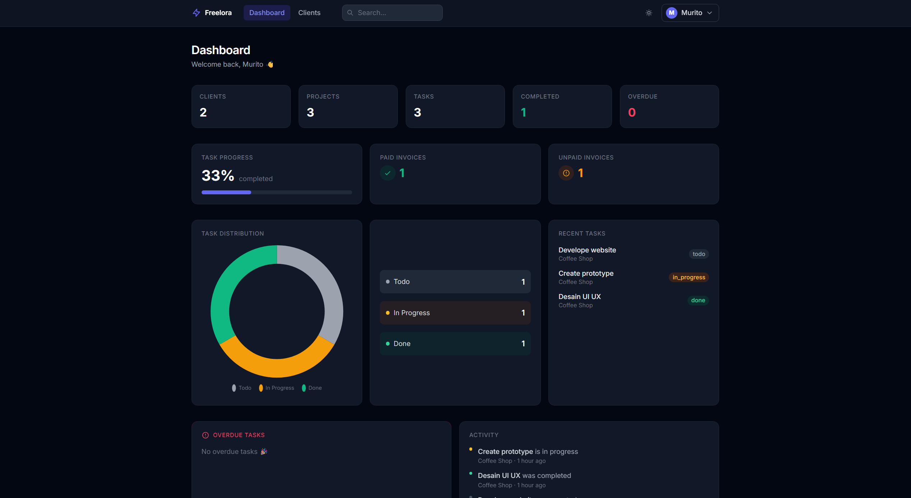
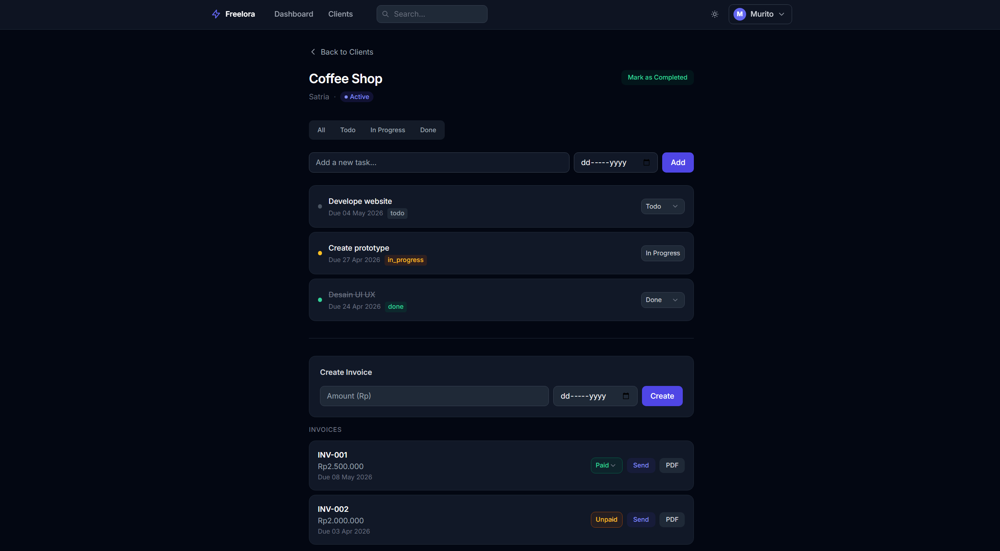
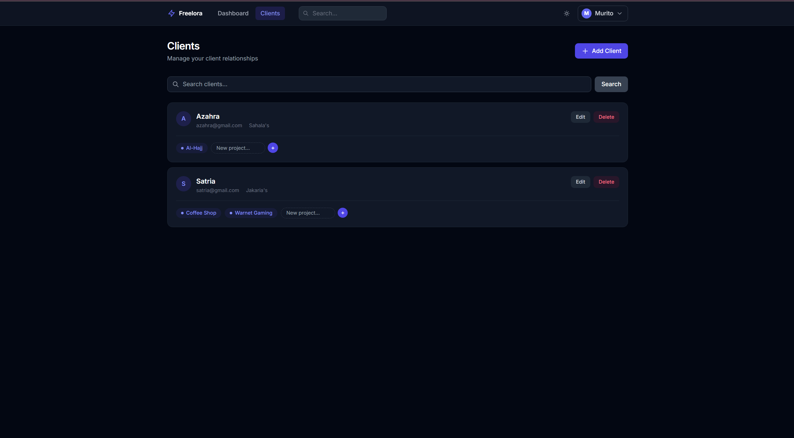

# Freelora 🚀

*A Freelance Management System built with Laravel*

---

## 📌 About The Project

**Freelora** is a web-based application designed to help freelancers manage their work in a more structured and professional way.

This project is built as part of a personal portfolio to demonstrate fullstack development skills using:

* Laravel (Backend)
* Blade + Vite (Frontend)
* SQLite (Development Database)

---

## ✨ Features

### ✅ Current

- Authentication (Laravel Breeze)
- Client Management (CRUD)
- Project Management (per client)
- Task Tracking (status, deadline, filtering)
- Dashboard Analytics (tasks, overdue, progress)
- Invoice System

### ⏳ Coming Soon

- Payment integration
- Role-based access
- Real-time updates

---

## 🛠️ Tech Stack

- PHP 8.3
- Laravel 13
- Blade (UI Rendering)
- Vite (Frontend Build Tool)
- Tailwind CSS
- SQLite (Development Database)

---

## ⚙️ Installation

```bash
git clone https://github.com/your-username/freelora.git
cd freelora

composer install
cp .env.example .env
php artisan key:generate

# create sqlite database
touch database/database.sqlite

php artisan migrate

npm install
npm run build

php artisan serve
```

---

## 🖼️ Preview

### Dashboard


### Project & Task Management With Invoice System


### Clients management


---

## 💡 Future Improvements

* Upgrade database to PostgreSQL (Supabase)
* Add API layer (REST)
* Implement role-based access
* Real-time updates
* Deploy to production

---

## 🧠 Author

Built by **Risto**

---

## ⭐ Notes

This project is actively being developed.
New features and improvements will be added continuously.

---
